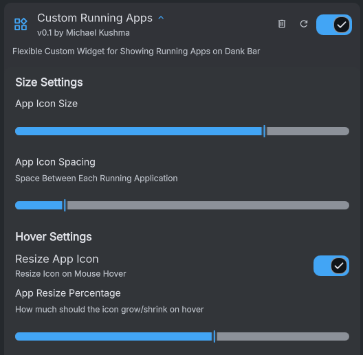

# Custom Running Apps (Dank Material Shell Plugin)

A flexible widget for **showing running applications on the Dank Bar**, with user-controlled **icon size**, **spacing**, and **hover resize** behavior.

- **Plugin ID:** `customRunningApps`
- **Version:** 0.1
- **Author:** Michael Kushma
- **Supported compositor(s):** `niri`

## Features

- Shows running applications on the Dank Bar
- Adjustable **App Icon Size**
- Adjustable **App Icon Spacing**
- Optional **hover resize** (grow/shrink on hover)
- Adjustable **hover resize percentage**
- More features planned (this is the initial setup)

## Requirements

- Dank Material Shell
- `niri` compositor (This might also work on Hyperland)

## Installation

1. Copy this plugin folder into your DankMaterialShell plugins directory (where you keep other custom plugins).
2. Reload/restart Dank Material Shell so it picks up the new plugin.
3. Enable **Custom Running Apps** in the plugin list.

OR

1. Hopefully available in the DankMaterialShell plugin store soon!

## Configuration

Open the plugin settings and adjust:

### Size Settings
- **App Icon Size** — controls the icon size
- **App Icon Spacing** — controls spacing between running apps

### Hover Settings
- **Resize App Icon** — enables/disables hover resizing
- **App Resize Percentage** — how much the icon grows/shrinks on hover

## Screenshot

